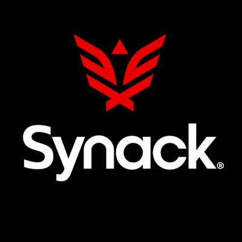

# Hacknetics

## Hacknetics

## If you're at the repo, view the Git-Book Here:

* https://book.ice-wzl.xyz&#x20;
* [<mark style="color:yellow;">https://ice-wzl.gitbook.io/hacknetics/</mark>](https://ice-wzl.gitbook.io/oscp-prep/)

#### Red Team Quality of Life Scripts

**Clipboard monitor**

* Never be unsure of what is in your clipboard buffer again



```
//create small window and run with
python3 clip.py
```

<figure><figcaption></figcaption></figure>

#### Terminator Config

* Note: systems have different fonts installed, if you use this config and the font spacing is wild, use the system default, or choose your own.

```
open terminal 
right click --> preferences --> profiles --> check the use system fixed width font
```

* These days I find myself using Terminator the most (and tmux), see below for my terminator config.
* To use it place this file at `~/.config/terminator/config`
* And make sure terminator is installed `sudo apt install terminator -y`
* Make sure to remove the .txt part when you pull the file down locally



#### Tmux Config

* This is the tmux config I am using these days

```
mkdir -p ~/.config/tmux
#place both these files in your ~/.config/tmux directory 
#change the .local file, do not make changes to the .conf file 
```





#### Big Thanks to our Sponsors

 .png>)
