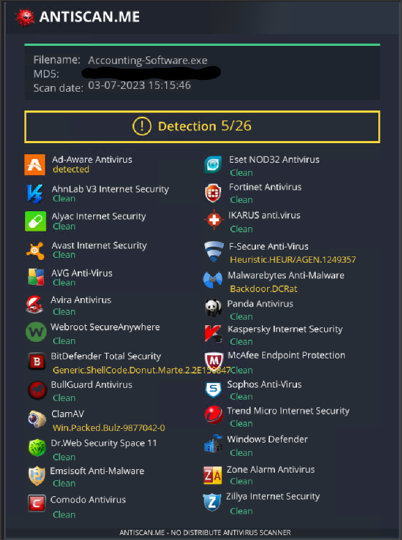

# Dcrat AV Evasion

* This page will document different payloads and their success against different AV engines
* `X` == Detection, do not run on a remote host
* `Yes` == No detection, safe to run on a remote host

| AV Engine                   | Shellcode Loader | Binary |
| --------------------------- | ---------------- | ------ |
| 
Windows Defender 
 | Yes              | X      |
| Kaspersky                   |                  |        |
| McAfee                      |                  |        |
| Sophos                      |                  |        |
| Malwarebytes                |                  |        |

## Custom Shellcode Loader

* I am currently working on a custom shellcode loader for Dcrat shellcode.
* This is written in `C#` like the RAT itself.

### Current Detections&#x20;

<figure><figcaption></figcaption></figure>
