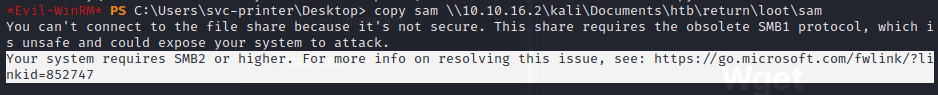

# Modules

* See below for each modules documentation&#x20;
* To get to modules right click a call back and you will see the following options

| Surveillance                          |
| ------------------------------------- |
| Remote Shell                          |
| Remote Screen                         |
| Remote Camera                         |
| Remote Regedit                        |
| File Manager                          |
| Process Manager                       |
| Netstat                               |
| Record                                |
| Program Notifications (Start \| Stop) |

### Remote Shell

* Exactly what it sounds like
* Click on the module wait for below to appear

```
Microsoft Windows [Version 10.0.20348.1787]
(c) Microsoft Corporation. All rights reserved.
```

* This is a `cmd.exe` prompt not a powershell prompt!
* Use the white bar at the bottom to execute commands&#x20;

<figure><figcaption></figcaption></figure>

### Remote Screen

* Also exactly what it sounds like
* View the remote screen of the remote system&#x20;
* It can take a second to load, please be patient.
* Screen sharing can be controlled (off/on) with the `Start` button at the top left&#x20;
* Option to `View only` or control the remote machine via your `mouse` and `keyboard`&#x20;
* To turn either on press the respective button at the top
*   Can also take auto screenshots with the `Camera` button also at the top &#x20;

    * By default it will capture the screen every \~3 seconds
    * IMO that is far too fast, I am working on tuning it to roughly every 30 seconds to drop the amount of network traffic that is required with the screenshots.


    <figure><figcaption></figcaption></figure>

### Remote Camera

* View the remote systems webcam
* Requires loading `RemoteCamera.dll` into memory which will happen automatically
* If no camera if found the pop up will exit automatically&#x20;

### Remote Regedit

* Remotely view the registry in addition to creation of new keys or modification of existing keys&#x20;

<figure><figcaption></figcaption></figure>

### File Manager&#x20;


### Process Manager&#x20;


### Netstat


### Record&#x20;


### Program Notification
