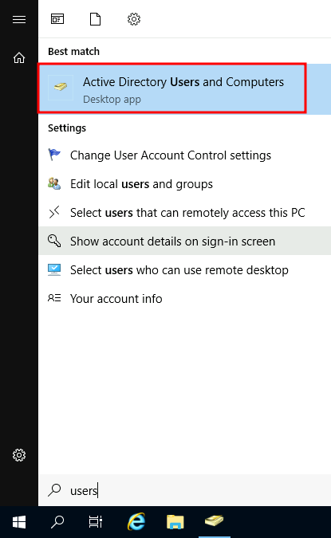
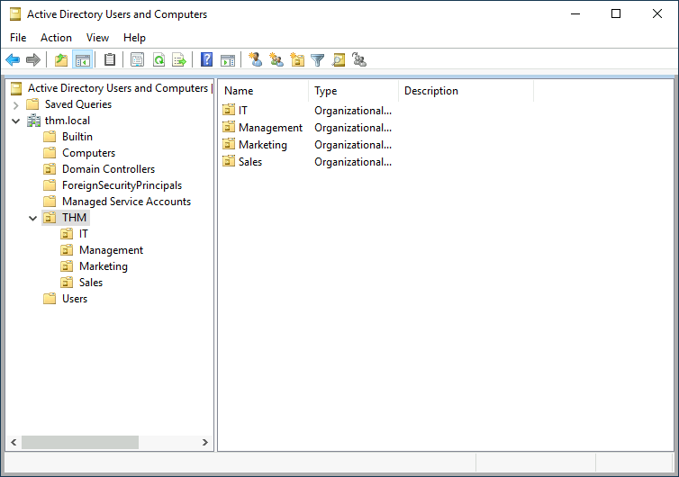
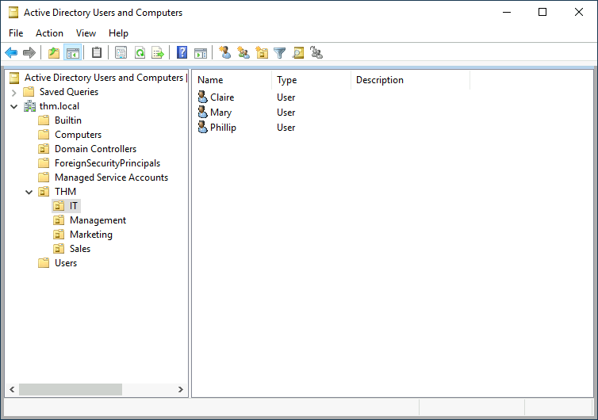
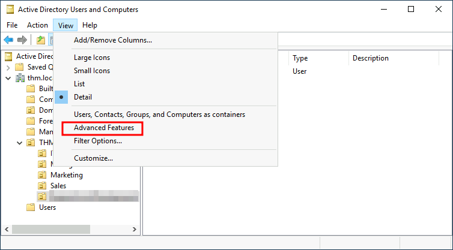
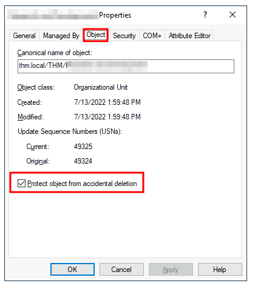
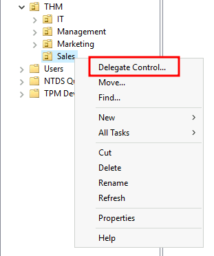
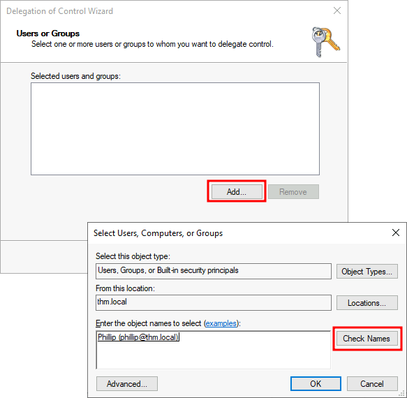
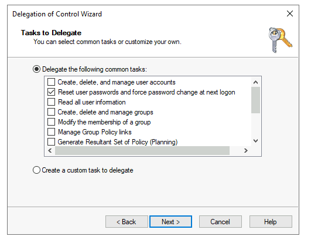
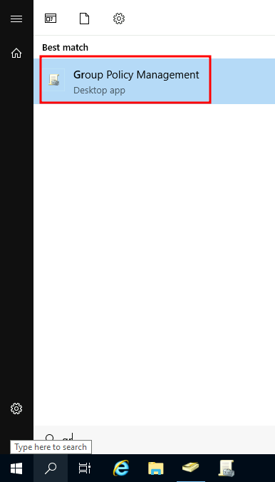
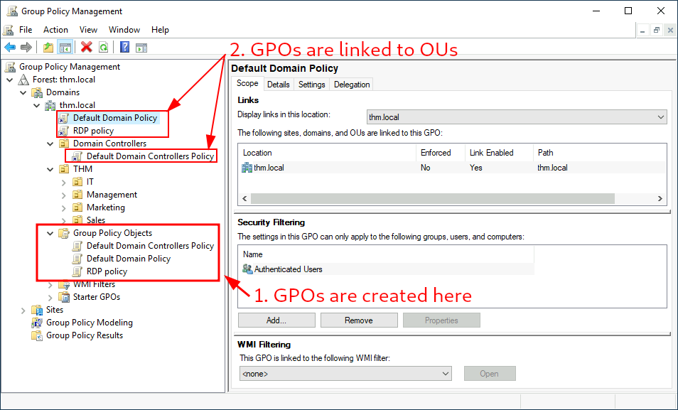

# AD Overview

### Windows Domain

* A Windows Domain is a group of user and computers under the administration of a business.
* Centralizes the administration of common windows components
* Stores it all in a centralized repo called Active Directory
* The server that runs AD is called a Domain Controller

### Advantages to Domains

* Centralized Identity Management - All users across the network can be configured from AD with minimum effort
* Managing Security Policies - You can configure security policies from AD and apply them to users and computers across the network&#x20;

### AD DS

* Active Directory Domain Service (AD DS) is at the core of every domain
* This service is a catalogue that holds all the information of the "objects" that exist in your network
* In terms of objects there are users, groups, machines, printers, shares, etc, etc

#### Users

* Users are one of the objects known as security principles&#x20;
* Means they can be authenticated by the domain and can be assigned privileges over a resource like a file or printer
* Security Principles can act upon a resource in a network&#x20;

#### People vs Services&#x20;

* Users can represent two types of entities&#x20;
  * People: users will generally represent peoples that need to access a network&#x20;
  * Services: you can difine users to be used by services i.e. IIS, MSSQL
* Every service requires a user to run but services differ from regular users as they will only have the privileges needed to run their specific service

#### Machines

* Machines are another type of object in a domain.
* For every computer that joins AD a machine object will be recreated
* Machines are considered Security Principles&#x20;
* They are assigned an account just like a user&#x20;
* This account has limited rights within the domain itself&#x20;
* The machine accounts themselves are local administrators on the assigned computer
* They are generally not supposed to be accessed by anyone except the computer itself&#x20;
* But if you have the password you can use them&#x20;
* Machine account passwords are automatically rotated out and are generally comprised of 120 random chars&#x20;

#### Identify Machine Accounts&#x20;

* They are easy to identify&#x20;
* They follow a specific naming scheme&#x20;
* Machine account name is the computer name followed by a $&#x20;
* i.e. if the computer name is `SRV01` the machine account is `SRV01$`&#x20;

#### Security Groups&#x20;

* You can define user groups to assign access rights to files and other resources to a group vice a user&#x20;
* Security groups are also considered security principals and can have privileges over resources on a network&#x20;

#### Default Domain Groups&#x20;

| Security Group     | Description                                                                                                                                               |
| ------------------ | --------------------------------------------------------------------------------------------------------------------------------------------------------- |
| Domain Admins      | Users of this group have administrative privileges over the entire domain. By default, they can administer any computer on the domain, including the DCs. |
| Server Operators   | Users in this group can administer Domain Controllers. They cannot change any administrative group memberships.                                           |
| Backup Operators   | Users in this group are allowed to access any file, ignoring their permissions. They are used to perform backups of data on computers.                    |
| Account Operators  | Users in this group can create or modify other accounts in the domain.                                                                                    |
| Domain Users       | Includes all existing user accounts in the domain.                                                                                                        |
| Domain Computers   | Includes all existing computers in the domain.                                                                                                            |
| Domain Controllers | Includes all existing DCs on the domain.                                                                                                                  |

### AD Users and Computers&#x20;

* To config users or groups or machines in AD we need to log into the DC and run `Active Directory Users and Computers`&#x20;
* This is located on the start menu&#x20;

<figure><figcaption></figcaption></figure>

* Will open a hierarchy of users, computers and groups that exist in a domain&#x20;
* They are all organized in `Organizational Units` `OUs`
* These are contain objects that allow you to classify users and machines&#x20;
* OUs are mainly used to define sets of users with similar policing requirements&#x20;
* Users can be a part of a single OU at a time&#x20;

<figure><figcaption></figcaption></figure>

* If you open any of the OUs you can see the users they contain
* This is where you can create, delete or modify them as needed
* Can also reset passwords here

<figure><figcaption></figcaption></figure>

### Default Containers&#x20;

* There are default containers in domains&#x20;
* Created by windows automatically&#x20;
  * **Builtin:** Contains default groups available to any Windows host.
  * **Computers:** Any machine joining the network will be put here by default. You can move them if needed.
  * **Domain Controllers:** Default OU that contains the DCs in your network.
  * **Users:** Default users and groups that apply to a domain-wide context.
  * **Managed Service Accounts:** Holds accounts used by services in your Windows domain.

### Security Groups vs OUs

* OUs - handy for applying policies to users and computers&#x20;
  * Include specific configs that pertain to sets of users depending on their particular role&#x20;
  * Users can only be a member of a single OU at a time
  * Cant apply two different policies to the same user&#x20;
* Security Groups&#x20;
  * Used to grant permissions over resources&#x20;
  * If you use groups and want to allow some users to have access over a shared folder&#x20;
  * Users can be in many groups at the same time

### Deleting extra OUs and users

* OUs are protected against accidential deletion&#x20;
* To delete them enable `Advanced Features` in the `View` menu
*

    <figure><figcaption></figcaption></figure>
* This will show you some more containers and enable you to toggle the accidental deletion protection on or off.&#x20;

<figure><figcaption></figcaption></figure>

### Delegation

* You can and should give specific users some control over some OUs&#x20;
* This is known as delegation and it allows specific privileges to perform advanced tasks on OUs without needing a DA to step in&#x20;
* One common example is granting `IT` Staff the ability to reset other low privilege users passwords&#x20;

#### How to Delegate

* To delegate control over an OU right click and select Delegate Control&#x20;

<figure><figcaption></figcaption></figure>

* This should open a new window where you should input the users name that you want to delegate to&#x20;
* Use the check names box to avoid a miss type&#x20;
*

    <figure><figcaption></figcaption></figure>
* Now you can see a new window that allows more granular delegation controls&#x20;

<figure><figcaption></figcaption></figure>

### AD Password Resets Powershell

```
PS C:\Users\phillip> Set-ADAccountPassword sophie -Reset -NewPassword (Read-Host -AsSecureString -Prompt 'New Password') -Verbose

New Password: *********

VERBOSE: Performing the operation "Set-ADAccountPassword" on target "CN=Sophie,OU=Sales,OU=THM,DC=thm,DC=local".
```

* Now make sure to force the user to update their password on next login so they dont keep using a password that we know!

```
PS C:\Users\phillip> Set-ADUser -ChangePasswordAtLogon $true -Identity sophie -Verbose

VERBOSE: Performing the operation "Set" on target "CN=Sophie,OU=Sales,OU=THM,DC=thm,DC=local".
```

### Managing Computers in AD

* All machines that join the domain (minus DC) will be put in a container called `Computers`&#x20;
* You will want to group the different machine types to be able to apply different policies to them
* You do not want to have the same policies for your end user workstations as your servers
* At minimum it pays off to have these three groups&#x20;
  *   **1. Workstations**

      Workstations are one of the most common devices within an Active Directory domain. Each user in the domain will likely be logging into a workstation. This is the device they will use to do their work or normal browsing activities. These devices should never have a privileged user signed into them.
  *   **2. Servers**

      Servers are the second most common device within an Active Directory domain. Servers are generally used to provide services to users or other servers.
  *   **3. Domain Controllers**

      Domain Controllers are the third most common device within an Active Directory domain. Domain Controllers allow you to manage the Active Directory Domain. These devices are often deemed the most sensitive devices within the network as they contain hashed passwords for all user accounts within the environment.

### Group Policies&#x20;

* Windows manages policies to OUs with `Group Policy Objects (GPO)`
* GPOs are simply a collection of setting that can be applied to OUs&#x20;
* GPOs can contain policies aimed at either users or computers, allowing you to set a baseline
*   To configure GPOs, you can use the **Group Policy Management** tool, available from the start menu:

    <br>

    <figure><figcaption></figcaption></figure>

### GPO Hierarchy&#x20;

* You will notice a GPO hierarchy when you open GPO Management tool
* To configure GPOs you first create a GPO under `Group Policy Objects` and then link it to the GPO where you want the policies to apply

<figure><figcaption></figcaption></figure>

