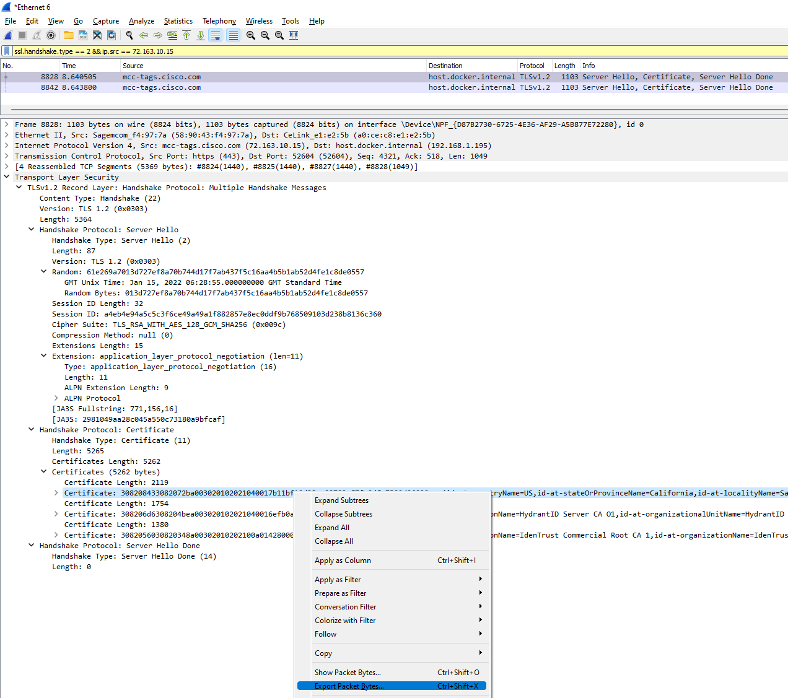
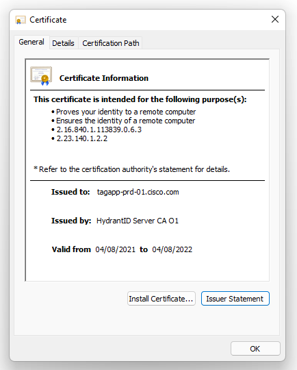

# Wireshark

### Great Quic Reference  <a href="#page-title" id="page-title"></a>

<figure><figcaption></figcaption></figure>

<figure><figcaption></figcaption></figure>

* Source: [https://packetlife.net/media/library/13/Wireshark\_Display\_Filters.pdf](https://packetlife.net/media/library/13/Wireshark\_Display\_Filters.pdf)

## [Identifying and retrieving TLS/SSL Certificates from a PCAP file using Wireshark.](https://richardatkin.com/post/2022/01/15/Identifying-and-retrieving-certificates-from-a-PCAP-file-using-Wireshark.html) <a href="#page-title" id="page-title"></a>

### Client <a href="#client" id="client"></a>

#### Find all Client TLS Hello packets <a href="#find-all-client-tls-hello-packets" id="find-all-client-tls-hello-packets"></a>

```
ssl.handshake.type == 1
```

#### Find all TLS Client Hello packets from a particular IP address <a href="#find-all-tls-client-hello-packets-from-a-particular-ip-address" id="find-all-tls-client-hello-packets-from-a-particular-ip-address"></a>

```
ssl.handshake.type == 1 && ip.addr == 35.160.54.177
```

#### Find all TLS Client Hello packets from a particular IP address and TCP port <a href="#find-all-tls-client-hello-packets-from-a-particular-ip-address-and-tcp-port" id="find-all-tls-client-hello-packets-from-a-particular-ip-address-and-tcp-port"></a>

```
ssl.handshake.type == 1 && ip.addr == 35.160.54.177 && tcp.port == 443
```

#### Find all TLS Client Hello packets that contain a particular SNI <a href="#find-all-tls-client-hello-packets-that-contain-a-particular-sni" id="find-all-tls-client-hello-packets-that-contain-a-particular-sni"></a>

```
ssl.handshake.type == 1 && tls.handshake.extensions_server_name contains "mozilla.com"
```

#### Find all TLS Client Hello packets with support for TLS v1.3 <a href="#find-all-tls-client-hello-packets-with-support-for-tls-v13" id="find-all-tls-client-hello-packets-with-support-for-tls-v13"></a>

```
ssl.handshake.type == 1 && tls.handshake.extensions.supported_version == 0x0304
```

#### Find all TLS Client Hello packets with support for TLS v1.2 <a href="#find-all-tls-client-hello-packets-with-support-for-tls-v12" id="find-all-tls-client-hello-packets-with-support-for-tls-v12"></a>

```
ssl.handshake.type == 1 && tls.handshake.extensions.supported_version == 0x0303
```

#### Find all TLS Client Hello packets with support for TLS v1.1 <a href="#find-all-tls-client-hello-packets-with-support-for-tls-v11" id="find-all-tls-client-hello-packets-with-support-for-tls-v11"></a>

```
ssl.handshake.type == 1 && tls.handshake.extensions.supported_version == 0x0302
```

#### Find all TLS Client Hello packets with support for TLS v1.0 <a href="#find-all-tls-client-hello-packets-with-support-for-tls-v10" id="find-all-tls-client-hello-packets-with-support-for-tls-v10"></a>

```
ssl.handshake.type == 1 && tls.handshake.extensions.supported_version == 0x0301
```

### Server

```
ssl.handshake.type == 2
```

Following the conversation

Once you’ve identified the Server Hello packet, it’s time to dig a little deeper.

First, ensure that your Wireshark is set to reassemble out-of-order TCP packets. Without this, it can sometimes be very difficult to complete this next step. You can verify that Wireshark is configured to do this by going to this page in the Wireshark GUI and ensuring that any reassembly related options are ticked.

### Enabling out-of-order TCP reassambly in Wireshark <a href="#enabling-out-of-order-tcp-reassambly-in-wireshark" id="enabling-out-of-order-tcp-reassambly-in-wireshark"></a>

```
Wireshark GUI:

  1. Edit > Preferences
     (A popup window should appear)

  2. In the popup window, go to "Protocols" and then "TCP"

  3. Ensure TCP reasembly options are enabled
```

### Find the Certificate <a href="#find-the-certificate" id="find-the-certificate"></a>

In the packet you’ve selected, identify the Transport Layer Security section and expand the contents. You are looking for a section similar to this:

Note that, depending on the particular Server / CA / Protocol you’re dealing with, the packet capture may contain multiple Certificates. You may also notice that some of the Certificates are bigger than the others. This is because the server has basically sent everything twice.&#x20;

### Extract the Certificate <a href="#extract-the-certificate" id="extract-the-certificate"></a>

Now you’ve found the Certificate, you can extract it by right clicking on the Certificate and selecting ‘Export packet bytes…’ and ave the file as a \*.cer file.

<figure><figcaption></figcaption></figure>

Once you’ve got the file save, you can then open it in Windows like any normal Certificate.

\


<figure><figcaption></figcaption></figure>
